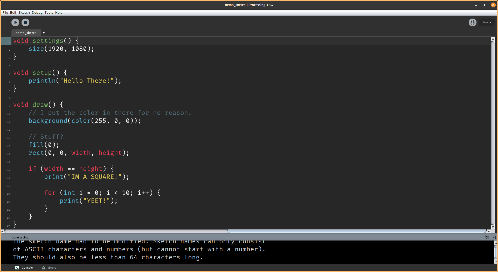

# monokai-apprentice-processing
My monokai's apprentice theme for processing (PDE).

You place the 'theme.txt' in C:/.../processing-(version)/lib/ for windows and /.../processing-(version)/lib for linux and you put the 'preferences.txt' in your (user directory)/.processing for both windows and linux. And I don't care about mac users, just use linux or windows (hopefully linux).

If you do not have the font 'Fira Code' you can go to line 20 or 'preferences.txt' to change the font family.

